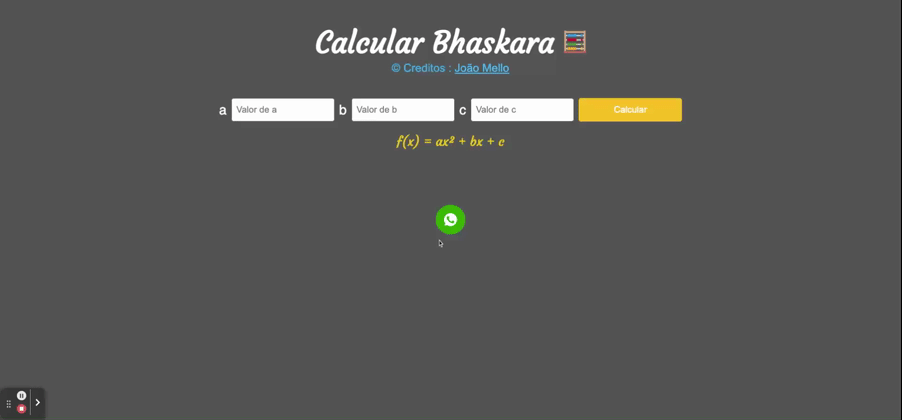

<h1 align='center'>Calcular Bhaskara</h1>

<h2 align='center'>Sobre</h2>

<h3 align='center'>Uma app que calcular delta, raizes, e vértices de uma equação de segundo grau</h3>

## 🚀 Technologies

<ul>
    <li>Javascript</li>
    <li>html</li>
    <li>css</li>
</ul>

  <h3>My linkedin</h3>
  

Made by João Pedro
